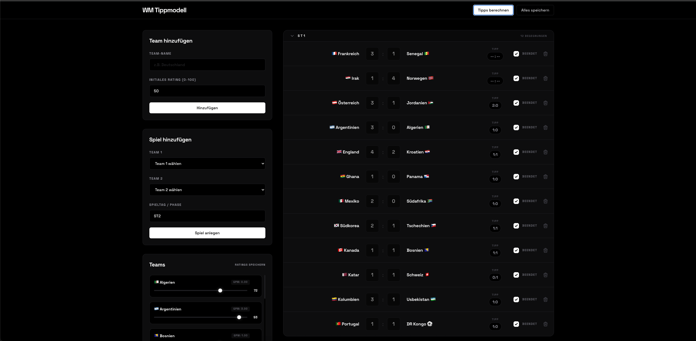

# World Cup 2026 Prediction Model

> A high-precision, local prediction tool powered by Poisson distributions. Minimalist dark-mode aesthetic.

## Features

- **100% Local & Autonomous:** Zero-latency data persistence via a local `data.json`. No external databases, no API dependencies.
- **Advanced Poisson Model:** Predictions are based on Expected Goals (xG), calculated by blending historical form (goals per match) with a custom 0-100 team rating. The most probable outcome is mathematically derived using a 7x7 probability matrix.
- **Intelligent Knockout Tie-Breaker:** The system automatically detects knockout rounds, rejects draw outcomes, and selects the next most probable scoreline that clearly determines a winner (factoring in team ratings).
- **Cascading Deletions:** Strict data integrity. When a team is removed, the engine safely and automatically purges all related matches from the state.
- **Minimalist Interface:** Radical monochrome design (Space Grotesk, Pitch Black). Features dynamic flag mapping (emoji conversion via ISO codes) and interactive, collapsible matchdays with animated SVG chevrons.



## Quickstart

Prerequisite: Python 3.10+

```bash
# 1. Create and activate a virtual environment
python3 -m venv venv
source venv/bin/activate  # Windows: venv\Scripts\activate

# 2. Install dependencies
pip install -r requirements.txt

# 3. Start the application
python3 app.py
```

Then open **[http://127.0.0.1:5000](http://127.0.0.1:5000)** in your browser.
